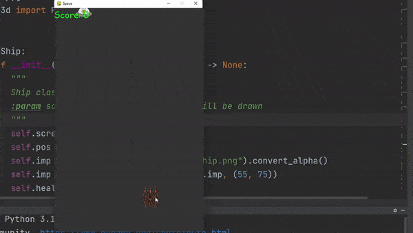

# ACE
ACE (niAei spaCe gamE) is a 2D space shooter game written on Python.

This game has no purpose other than showing coding is fun. With good coding experience, one can create a game with a 
little effort.



## Requirements

- `pygame==2.1.2`
- `v3d==0.0.5`

## Installation

### Obtain ACE:

```bash
git clone https://github.com/mshemuni/ACE.git

cd ACE
```

### Install requirements

```bash
pip install pygame==2.1.2 v3d==0.0.5
```

or

```bash
pip install -r requirements.txt
```

### Run it

```bash
python main.py
```

## Author
Mohammad S.Niaei

m.shemuni@gmail.com
